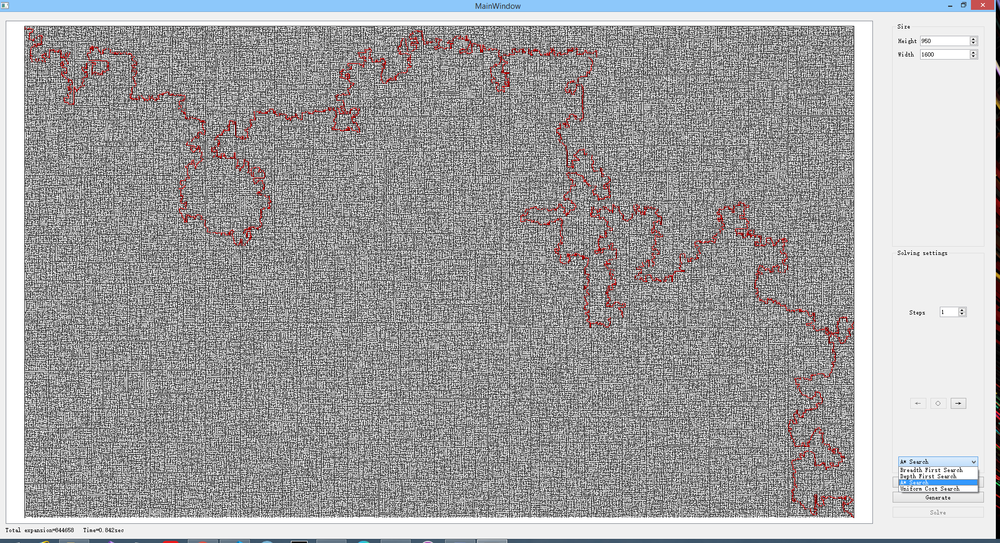

# (A)MAZE
## Introduction
This is a graduate student project for CS7750, Intro to AI, in University of Missouri. It's a maze generator *(not perfect maze, meaning multiple solutions)* using **Recursive Generating Algorithm** with 4 solving algorithm learned throughout the course:
- Breadth First Search
- Depth First Search
- Uniform Cost Search
- A*
## Compile
This is a QT/Visual Studio project. To compile, you can either:
- Open ``./GraduateProject.pro`` with QT5 and build it
- Open ``./GraduateProject.sln`` with Visual Studio and build it
The project is written with ``C++17``.
* Due to QT open source policy, free version only links with dynamic library. So you have to install QT.
## Documentation
A screenshot of brief view of the project:
  
For more introduction and documentation, refer to [documentation folder](./Documentation/Project%20Report.docx).